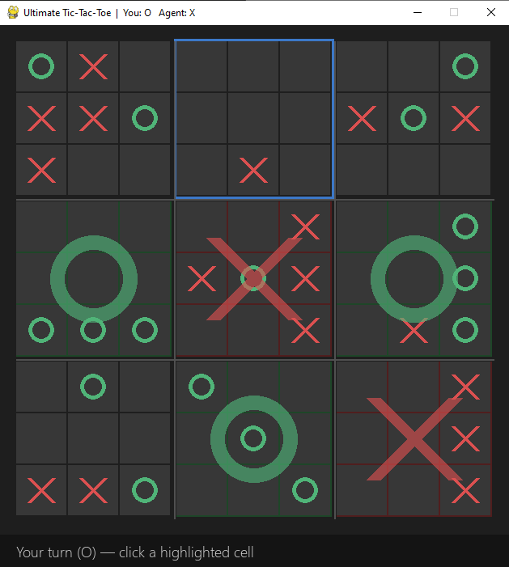
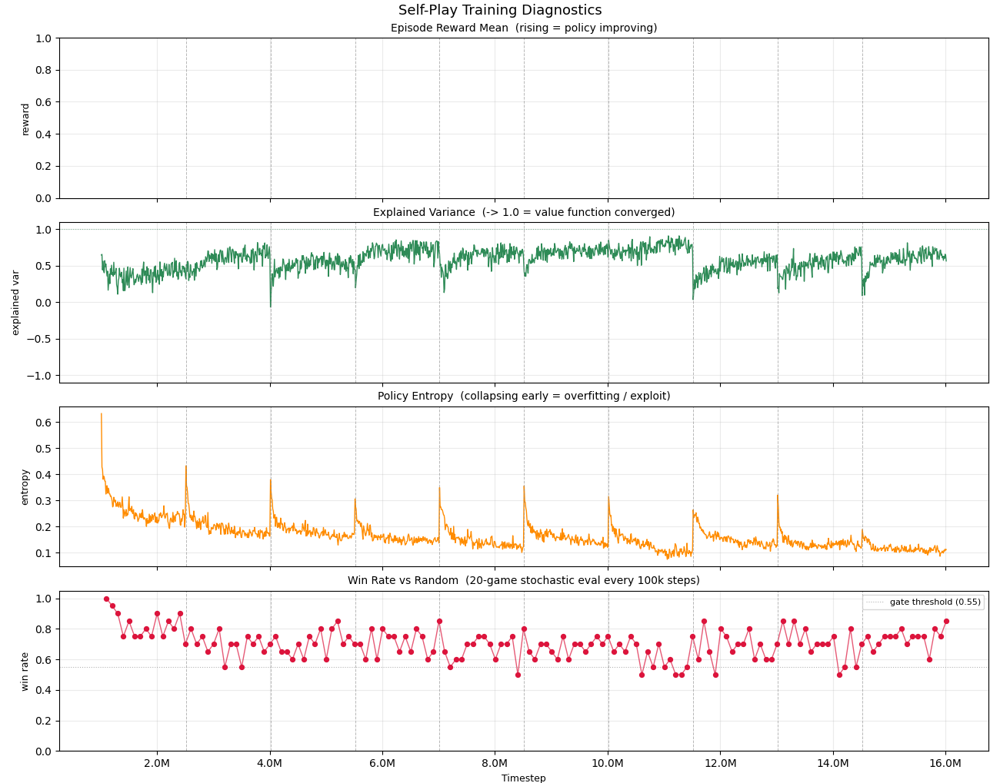

# Ultimate Tic-Tac-Toe — Reinforcement Learning Agent

A self-play reinforcement learning agent that learns to play **Ultimate Tic-Tac-Toe** (UTTT) from scratch using Proximal Policy Optimization (PPO) with action masking.



**[Download the Windows installer from Releases](../../releases/latest)** to play against the agent — no Python installation required.

---

## What is Ultimate Tic-Tac-Toe?

UTTT is a two-player strategy game played on a 9×9 board divided into nine 3×3 sub-boards. The twist: **where you play determines where your opponent must play next**. Win three sub-boards in a row to win the game.

The state space has ~10^38 possible positions — orders of magnitude larger than standard Tic-Tac-Toe — making it a meaningful benchmark for strategic reasoning.

---

## Approach

The agent is trained via **self-play** using [Maskable PPO](https://sb3-contrib.readthedocs.io/en/master/modules/ppo_mask.html) from Stable Baselines 3. Action masking is essential here: UTTT has a variable legal-move set each turn depending on the active sub-board.

### Training pipeline

```
Seed model                Checkpoint pool          Self-play training
(vs random, 95% WR)  -->  [seed, ckpt1, ckpt2, …]  -->  updated policy
                                    ^                          |
                                    |__________________________|
                                    (gated: only add if WR > 55%)
```

Key design decisions:
- **Warm-start**: training begins from the seed model (95% vs random), not random weights. Starting cold causes the agent to immediately forget all UTTT knowledge and exploit random artifacts.
- **Seed anchoring**: the seed model is sampled with ≥25% probability throughout training, preventing the pool from diluting the quality floor.
- **Win-rate gating**: a new checkpoint is only added to the pool if it beats the existing pool at ≥55%. This prevents policy collapse via exploit-accumulation.

---

## Training runs

| Run | Config | Best checkpoint | vs Random | Notes |
|-----|--------|----------------|-----------|-------|
| 1 | Self-play, random init | 5M steps | 87.5% | Policy collapse; ELO bug |
| 2 | Warm-start + seed anchor + gating | 500k steps | **97%** | Fixes validated |
| 3 | + sub-board reward shaping (±0.1) | 2.5M steps | 82.5% | First to beat developer in playtesting |
| 4 | Sub-board reward ±0.3 | 13.5M steps | ~63% | Reward too strong; shaped policy dominated by sub-boards |

Run 1 uncovered two bugs:
1. **ELO formula error** — `K * total * (score − expected)` inflated every shift by 200×, producing ±10k ELO swings. Fixed to standard `K * (score − expected)`.
2. **Policy collapse** — three compounding causes diagnosed and fixed independently (see above).

### Diagnostic plots

Training diagnostics are logged every 10k steps and visualized in `plot_training.py`:

- Episode reward mean — is the policy improving?
- Explained variance — is the value function converging?
- Policy entropy — is the model collapsing to a fixed exploit strategy?
- Win rate vs random — is general UTTT skill being retained?



---

## Key finding

After four runs of reward shaping experiments, a core limitation is architectural: an MLP sees a **flat 109-dimensional vector** and has not learned spatial board patterns (blocking threats, two-in-a-row setups) regardless of reward structure.

**Next step**: CNN policy — reshape the board into a 9×9 multi-channel image so spatial patterns become learnable convolution features.

---

## Project structure

```
uttt_game.py          — shared game logic (board, legal moves, win detection)
test_game.py          — unit tests for game logic
requirements.txt      — Python dependencies

mlp/                  — MLP policy experiments
  uttt_env.py         — Gymnasium env (agent vs random)
  self_play_env.py    — self-play env with opponent pool sampling
  utils.py            — flip_obs(): normalize observation to agent-as-X
  train.py            — seed model training (vs random)
  train_self_play.py  — full self-play training loop
  evaluate.py         — win rate + round-robin ELO evaluation
  play.py             — interactive PyGame UI (human vs agent)
  plot_training.py    — diagnostic plot from training_metrics.csv

best_models/          — one best checkpoint per run
cnn/                  — CNN policy (in development)
```

---

## Play it yourself

### Option 1: Windows installer (recommended)

Download `uttt-agent-setup.exe` from the [Releases page](../../releases/latest) and run it. No Python required.

### Option 2: Run from source

```bash
git clone https://github.com/DannyNagelMath/uttt-rl
cd uttt-rl
python -m venv venv
venv\Scripts\activate
pip install -r requirements.txt
cd mlp
python play.py
```

---

## Stack

- **Python 3.11**
- [Stable Baselines 3](https://stable-baselines3.readthedocs.io/) + [SB3-Contrib](https://sb3-contrib.readthedocs.io/) (MaskablePPO)
- [Gymnasium](https://gymnasium.farama.org/) — custom UTTT environment
- [PyGame](https://www.pygame.org/) — interactive game UI
- [PyTorch](https://pytorch.org/) — neural network backend
